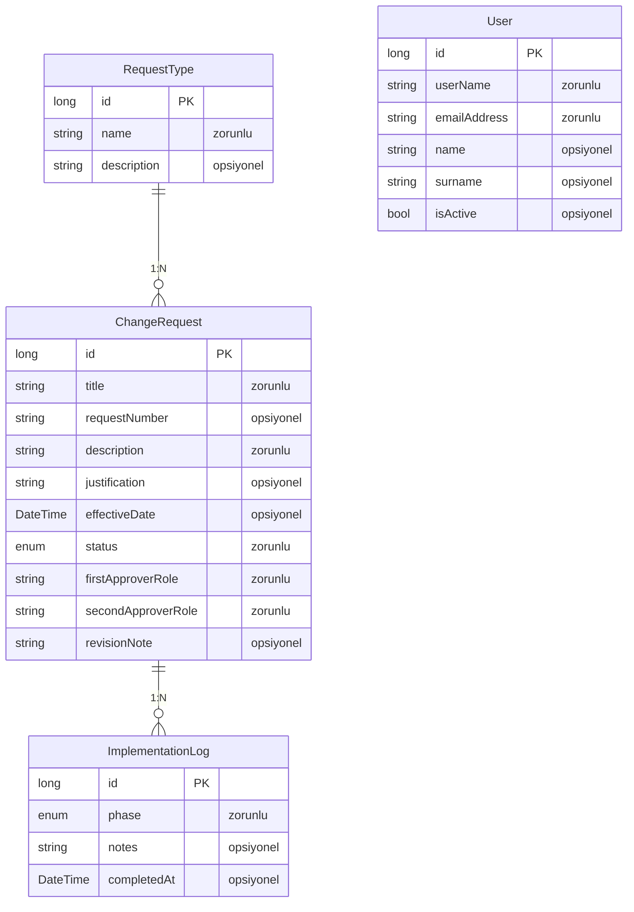
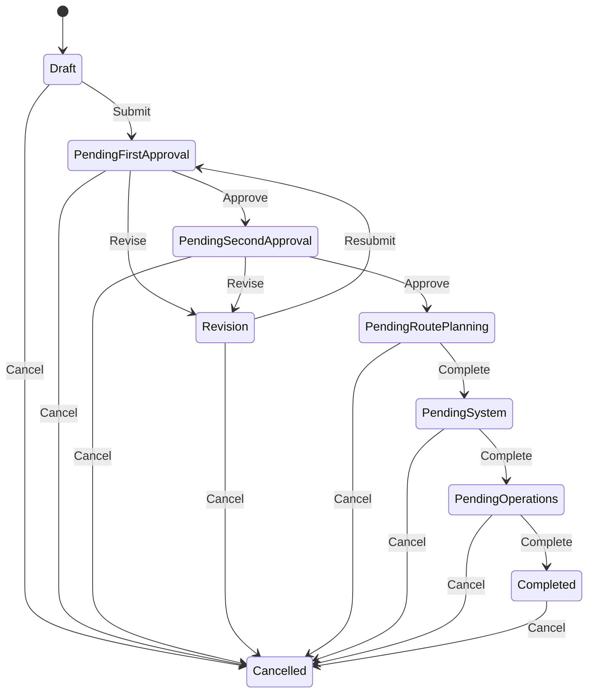
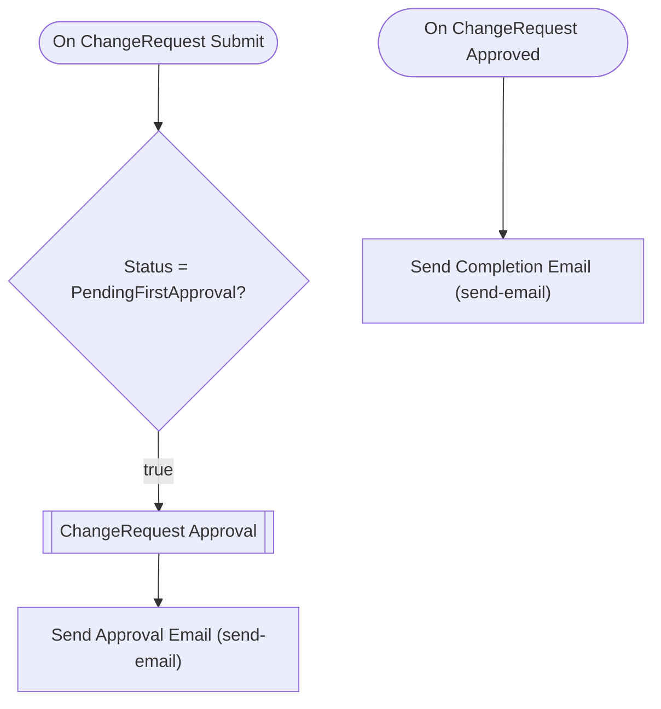

# talepplanlama — Talep Analizi

> Bu belge Archipid talep olgunlaştırma (discovery) akışıyla üretildi.

## Orijinal Talep

bir talep yönetim uygulaması istiyoruz. örnek olarak a ekibi talebi oluşturacak iki aşamalı onaydan geçtikten sonra havuza düşecek bu havuzdaki talepleri b ekibi inceleyecek ve 3 aşamada talebi tamamlayacak

## Özet

Bu uygulama, havacılık operasyonlarında uçuş tarifeleri, frekanslar ve sektörlerle ilgili değişiklik taleplerinin dijital ortamda yönetilmesini sağlar. Talepler oluşturulur, iki kademeli yönetici onayından geçer ve ardından ilgili ekipler tarafından sırayla uygulanıp kapatılır.

Talep sahibi yeni bir değişiklik talebi oluşturur ve formda iki onaylayıcı seçerek onaya gönderir. Birinci yönetici onaylar (ya da revize ister), ardından ikinci yönetici onaylar. Her iki onay tamamlanınca talep Rota Planlama ekibine düşer; Rota Planlama inceler ve tamamlayınca Sistem ekibine geçer; Sistem gerekli güncellemeleri yapıp Operasyon ekibine iletir; Operasyon son kontrolü yaparak talebi kapatır. Herhangi bir aşamada revize istenirse talep oluşturana geri döner.

## Kapsam

- Değişiklik talebi oluşturma (generic yapı; talep tipi enum ile seçilir)
- 2 aşamalı yönetici onayı (formda seçilen kişiler)
- Onay sonrası 3 aşamalı uygulama süreci: Rota Planlama → Sistem → Operasyon
- Her aşamada not/açıklama tutulması
- Talep durumunun anlık takibi ve ekip bazlı görev listeleri

## Kapsam Dışı

- Dosya/belge eki yükleme — bu sürümde desteklenmiyor
- SMS veya push bildirim — yalnızca e-posta bildirimi destekleniyor
- SLA / süre takibi / otomatik eskalasyon — bu sürümde desteklenmiyor
- Otomatik talep numarası üretimi — numara alanı kullanıcı tarafından girilir
- Onay adımlarında koşullu yönlendirme (talep tipine göre farklı onay yolu) — tüm tipler aynı akıştan geçer

## Açık Noktalar

- Her uygulama aşamasında (Rota Planlama, Sistem, Operasyon) onaycı/işlem yapan kişinin kim olduğu forma mı girilecek, yoksa sabit rol mi kullanılacak? (Şu an sabit rol olarak modellendi)
- Talep tipi (Tarife/Frekans/Sektör vb.) enum olarak listelenecek mi, serbest metin mi?

## Eksiklikler

- Talep tipleri henüz netleşmedi; generic enum ile başlanıyor, ilerleyen süreçte genişletilebilir
- Her uygulama aşamasında ek belge/not dışında özel alan gerekip gerekmediği netleştirilmeli
- İkinci onay aşamasında revize istenirse birinci onaya mı yoksa talep sahibine mi dönüleceği belirsiz (şu an talep sahibine dönüyor)

## Öneriler

- Talep tipleri netleşince enum değerleri güncellenebilir; altyapı hazır
- Rota Planlama, Sistem ve Operasyon aşamalarına ek not alanı eklenerek ilerleme kaydı tutulabilir
- Dashboard'da ekip bazlı 'Bende Bekleyen' widget'ları ile her ekip kendi iş yükünü görebilir

## Veri Modeli

### RequestType — Talep Tipi

| Alan | Tip | Zorunlu | Uzunluk |
|---|---|---|---|
| `id` | long | Evet | — |
| `name` | string | Evet | 200 |
| `description` | string | Hayır | 500 |

**Neye bağlı:** ChangeRequest (1:N, bu tablo "bir" tarafı)

### ChangeRequest — Değişiklik Talebi

| Alan | Tip | Zorunlu | Uzunluk |
|---|---|---|---|
| `id` | long | Evet | — |
| `title` | string | Evet | 300 |
| `requestNumber` | string | Hayır | 50 |
| `description` | string | Evet | 2000 |
| `justification` | string | Hayır | 1000 |
| `effectiveDate` | DateTime | Hayır | — |
| `status` | enum (Draft,PendingFirstApproval,PendingSecondApproval,Revision,PendingRoutePlanning,PendingSystem,PendingOperations,Completed,Cancelled) | Evet | — |
| `firstApproverRole` | string | Evet | — |
| `secondApproverRole` | string | Evet | — |
| `revisionNote` | string | Hayır | 1000 |

**Neye bağlı:** RequestType (1:N, bu tablo "çok" tarafı) · ImplementationLog (1:N, bu tablo "bir" tarafı)

### ImplementationLog — Uygulama Kaydı

| Alan | Tip | Zorunlu | Uzunluk |
|---|---|---|---|
| `id` | long | Evet | — |
| `phase` | enum (RoutePlanning,System,Operations) | Evet | — |
| `notes` | string | Hayır | 2000 |
| `completedAt` | DateTime | Hayır | — |

**Neye bağlı:** ChangeRequest (1:N, bu tablo "çok" tarafı)

### User — Kullanıcı (Sistem)

| Alan | Tip | Zorunlu | Uzunluk |
|---|---|---|---|
| `id` | long | Evet | — |
| `userName` | string | Evet | 64 |
| `emailAddress` | string | Evet | 256 |
| `name` | string | Hayır | 128 |
| `surname` | string | Hayır | 128 |
| `isActive` | bool | Hayır | — |

**Neye bağlı:** bağımsız tablo

## İş Akışları

### Değişiklik Talebi — durum makinesi

**Onay adımları**

| # | Adım | Atanan | Aksiyonlar | Zorunlu alanlar |
|---|---|---|---|---|
| 1 | First Approver | Alan: `firstApproverRole` | Onayla (approve), Revize Et (revise) | `revisionNote` |
| 2 | Second Approver | Alan: `secondApproverRole` | Onayla (approve), Revize Et (revise) | `revisionNote` |

Reddedilirse kayıt **`Revision`** durumuna döner.

### Akış: ChangeRequest Approval Flow

Auto-generated approval flow for ChangeRequest. Customize email templates and add conditions as needed.

## Örnek Senaryolar

### Mutlu Yol — Talep açılır, onaylanır, 3 aşamada uygulanır ve kapatılır

**Aktör:** Talep Sahibi / RoutePlanning / SystemTeam / Operations

1. Talep sahibi yeni bir ChangeRequest oluşturur, birinci ve ikinci onaylayıcıyı seçer, onaya gönderir
2. Birinci onaylayıcı talebi onaylar (PendingFirstApproval → PendingSecondApproval)
3. İkinci onaylayıcı talebi onaylar (PendingSecondApproval → PendingRoutePlanning)
4. Rota Planlama ekibi talebi inceler, ImplementationLog kaydı ekler ve tamamlar (PendingRoutePlanning → PendingSystem)
5. Sistem ekibi güncellemeleri yapar, ImplementationLog kaydı ekler ve tamamlar (PendingSystem → PendingOperations)
6. Operasyon ekibi son kontrolü yapar, talebi kapatır (PendingOperations → Completed)

**Dokunulan kayıtlar:** ChangeRequest, ImplementationLog  
**Durum geçişleri:** Draft->PendingFirstApproval · PendingFirstApproval->PendingSecondApproval · PendingSecondApproval->PendingRoutePlanning · PendingRoutePlanning->PendingSystem · PendingSystem->PendingOperations · PendingOperations->Completed

### Revizyon Yolu — İkinci onaylayıcı revize ister, talep sahibine döner

**Aktör:** İkinci Onaylayıcı / Talep Sahibi

1. İkinci onaylayıcı talebi yetersiz bulur, revizyon notu yazarak reddeder
2. Talep Revision durumuna düşer; talep sahibine bildirim gider
3. Talep sahibi güncelleme yapar ve yeniden onaya gönderir
4. Süreç baştan başlar (PendingFirstApproval → ...)

**Dokunulan kayıtlar:** ChangeRequest  
**Durum geçişleri:** PendingSecondApproval->Revision · Revision->PendingFirstApproval

### Yetkisiz Erişim — Sistem ekibi üyesi Rota Planlama aşamasını tamamlamaya çalışır

**Aktör:** SystemTeam

1. Sistem ekibi üyesi PendingRoutePlanning durumundaki bir talebi açar
2. Tamamla aksiyonu yalnızca RoutePlanning rolüne açık olduğundan buton görünmez/engellenir
3. Talep PendingRoutePlanning durumunda kalmaya devam eder

**Dokunulan kayıtlar:** ChangeRequest  

## Elle Geliştirme Gerektirenler

Aşağıdaki maddeler senaryonun gereği ama üretilen koda yansımıyor — kod yazılması gerekir.

| Alan | İş | Neden | Geçici çözüm |
|---|---|---|---|
| approval | Rota Planlama → Sistem → Operasyon geçişlerinin approval motoru dışında manuel tetiklenmesi | Onay motoru yalnızca 'Approve' action'ıyla Pending* durumlarını ilerletir ve her adım bir approval step gerektirir. Ancak bu 3 aşama onay değil, iş tamamlama adımlarıdır; ekip üyesi kendi aşamasını 'Tamamla' diyerek ilerletmeli. Bu geçişler approval workflow yerine role bazlı manuel transition olarak modellenmiştir — uygulama ekibinin geçiş butonlarını doğru role kısıtlaması gerekir. | Her aşama için ayrı Pending* durumu ve 'Complete' action'ı tanımlandı. Rol kısıtlaması uygulama katmanında yapılmalı. |

## Şema Açıklamaları

- **RequestType** — Talep tiplerinin yönetildiği parametre tablosudur. Sistem yöneticisi yeni tipler ekleyebilir; ileride generic enum'un yerini alabilir.
- **ChangeRequest** — Tüm değişiklik taleplerinin merkezi kaydıdır. Generic yapıda tutulmuştur; talep tipi enum ile seçilir, detay serbest metin alanlarıyla eklenir. Onay ve uygulama sürecinin tamamı bu kayıt üzerinden izlenir.
- **ImplementationLog** — Her uygulama aşamasında (Rota Planlama, Sistem, Operasyon) yapılan işlemlerin ve notların tutulduğu kayıttır. Talebe bağlı birden fazla log satırı olabilir.

- **User → ChangeRequest** — Bir kullanıcı birden fazla değişiklik talebi açabilir; her talebin bir oluşturanı vardır.
- **ChangeRequest → ImplementationLog** — Onaylanan her talep için Rota Planlama, Sistem ve Operasyon ekiplerinin kaydettiği uygulama notları talebe bağlıdır.
